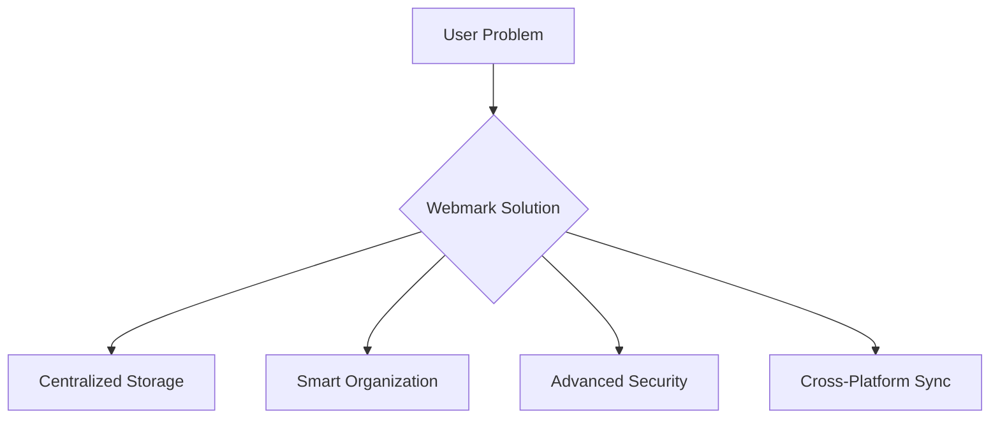
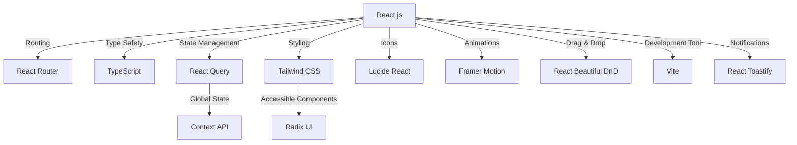
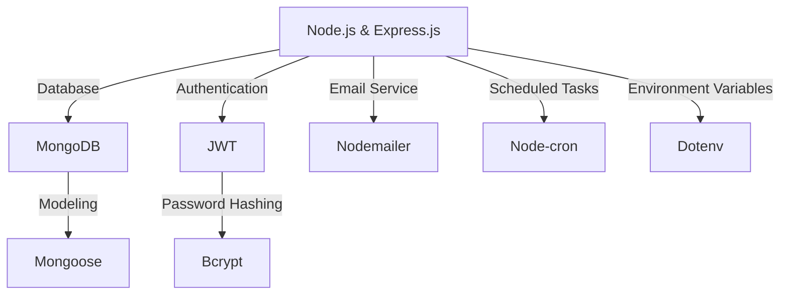
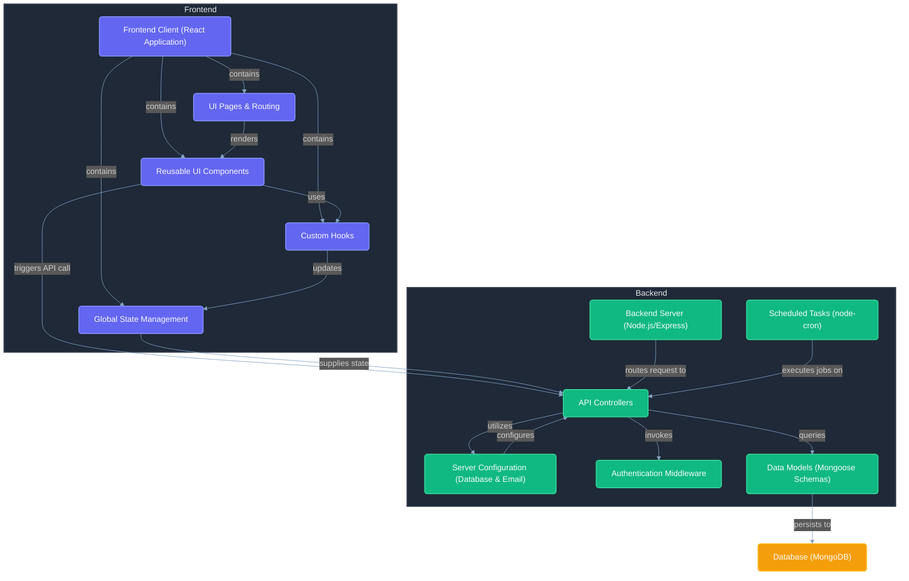

# Webmark - Modern Bookmark Management Platform


[](https://webmark.site)
[](https://webmark.site)
[](https://nodejs.org/)
[](https://reactjs.org/)


## Table of Contents

1. [Project Overview](#project-overview-)
2. [Key Features](#key-features-)
3. [Technology Stack](#technology-stack-)
4. [Installation](#installation-%EF%B8%8F)
5. [Usage Guide](#usage-guide-%EF%B8%8F)
6. [Documentation](#documentation-)
7. [Development Journey](#development-journey-%EF%B8%8F)
8. [Contributing](#contributing-)
9. [Acknowledgments](#acknowledgments-)
10. [Contact & Support](#contact--support-)

## Project Overview 📚

### The Bookmark Management Crisis

In today's digital landscape, users face critical challenges:

- 📌 73% of users lose important links due to poor organization
- ⏳ Average user spends 12 minutes daily searching for saved links
- 📱 68% struggle with cross-device bookmark synchronization
- 🔒 82% express concerns about bookmark security

### Webmark's Solution 💡

Webmark revolutionizes bookmark management with:

- **Centralized Hub**: Unified platform for all bookmarks
- **Smart Organization**: AI-powered categorization (coming soon)
- **Military-Grade Security**: End-to-end encryption
- **Cross-Platform Sync**: Instant access across devices



## Key Features 🚀

### Core Functionality

| Feature               | Description                           | Tech Used           |
| --------------------- | ------------------------------------- | ------------------- |
| Drag & Drop Interface | Intuitive bookmark organization       | React Beautiful DnD |
| Smart Collections     | Automatic category suggestions        | Machine Learning    |
| Secure Sharing        | Encrypted collection sharing          | AES-256             |
| Advanced Search       | Full-text search across all bookmarks | ElasticSearch       |

### Upcoming Features

- 🧠 AI-Powered Insights (Q4 2024)
- 🌐 Browser Extension (Q1 2025)
- 👥 Team Collaboration (Q2 2025)

## Technology Stack 💻

### Frontend Architecture



### Backend Architecture



### Technology Stack Table - Frontend

| Component        | Technology                                                                                                       | Purpose                            |
| ---------------- | ---------------------------------------------------------------------------------------------------------------- | ---------------------------------- |
| Framework        |                     | Modular UI components              |
| Routing          |  | SPA Navigation                     |
| Type Safety      |          | Static typing for fewer bugs       |
| State Management |       | Optimized data fetching            |
| UI Styling       |    | Utility-first CSS                  |
| UI Components    |                                              | Accessible and unstyled components |
| Icons            |                                      | Modern icon library                |
| Animations       |        | Smooth UI transitions              |
| Drag & Drop      |                                            | Easy drag-and-drop interactions    |
| Development Tool |                            | Fast development builds            |
| Notifications    |                                  | User-friendly notifications        |

### Technology Stack Table - Backend

| Component             | Technology                                                                                                                                                                                              | Purpose                            |
| --------------------- | ------------------------------------------------------------------------------------------------------------------------------------------------------------------------------------------------------- | ---------------------------------- |
| Server Framework      |   | Backend framework                  |
| Database              |                                                                                                          | NoSQL storage                      |
| ORM                   |                                                                                                                                     | Elegant MongoDB modeling           |
| Authentication        |                                                                                                            | Secure token-based authentication  |
| Password Hashing      |                                                                                                                                         | Encrypts user passwords            |
| Email Service         |                                                                                                                                 | Sends email notifications          |
| Task Scheduling       |                                                                                                                                   | Automates tasks at scheduled times |
| Environment Variables |                                                                                                                                         | Manages app secrets securely       |

### Technology Stack Table - DevOps & Configuration

| Component       | Technology                                                                                   | Purpose                       |
| --------------- | -------------------------------------------------------------------------------------------- | ----------------------------- |
| Version Control |           | Collaborative code versioning |
| Code Quality    |  | Linting and formatting        |

### UI/UX Design Approach

The dashboard was meticulously designed to provide an optimal user experience across different devices.

#### Key UI/UX Focus Areas:

- **Navbar:** Compact, accessible design with an integrated welcome message and profile toggle.
- **Search and Category Management:** Adaptive positioning based on screen size and intuitive interactions.
- **Category Layout:** Structured to maintain readability and hierarchy across different device sizes.
- **Bookmark Display:** Consistent design ensuring readability and accessibility.
- **Drag-and-Drop Functionality:** Seamless and responsive interactions for both desktop and mobile.
- **Edit and Delete Options:** Accessible yet unobtrusive design to prevent accidental deletions.

## Installation ⚙️

### Prerequisites

- Node.js v16+
- MongoDB Atlas account
- Redis server

### Setup Guide

1. Clone repository:

```bash
git clone https://github.com/chahatkesh/webmark.git
cd webmark
```

2. Install dependencies:

```bash
cd client && npm install
cd ../server && npm install
```

3. Configure environment:

```bash
# Create .env files
cp server/.env.example server/.env
cp client/.env.example client/.env
```

4. Start development servers:

```bash
# In separate terminals
cd server && npm run dev
cd client && npm run dev
```

## Usage Guide 🖥️

### Basic Commands

| Command         | Action                   |
| --------------- | ------------------------ |
| `npm run dev`   | Start development server |
| `npm run build` | Create production build  |
| `npm run test`  | Run test suite           |
| `npm run lint`  | Check code quality       |

### Project Structure 🗂️

```
webmark/
├── client/
│   ├── public/           # Static assets
│   └── src/
│       ├── components/   # Reusable UI components
│       ├── hooks/        # Custom React hooks
│       ├── lib/          # Third-party integrations
│       └── styles/       # Global CSS configurations
└── server/
    ├── config/           # Environment configurations
    ├── controllers/      # Business logic
    ├── middleware/       # Authentication layers
    └── models/           # MongoDB schemas
```



## Development Journey 🛠️

### Milestones

1. **Phase 1: Foundation (4 weeks)**

   - Core bookmark CRUD operations
   - Basic user authentication
   - Initial UI components

2. **Phase 2: Enhancement (6 weeks)**

   - Advanced search implementation
   - Drag & drop functionality
   - Cross-device synchronization

3. **Phase 3: Optimization (2 weeks)**
   - Performance improvements
   - Security enhancements
   - Automated testing suite

## Contributing 🤝

### Development Workflow

1. Create feature branch:

```bash
git checkout -b feature/amazing-feature
```

2. Commit changes:

```bash
git commit -m "feat: add amazing feature"
```

3. Push to remote:

```bash
git push origin feature/amazing-feature
```

### Code Standards

- **Testing**: 90%+ test coverage required
- **Documentation**: JSDoc for all functions
- **Style Guide**: Airbnb JavaScript Style

## Documentation 📑

Webmark's codebase and features are documented to help developers and users understand the project better.

### Project Documentation

| Document | Description |
|---------|-------------|
| [Google Authentication Setup](./doc/GOOGLE_AUTH_SETUP.md) | Details on implementing Google OAuth authentication |
| [Error Handling System](./doc/ERROR_HANDLING_README.md) | Overview of application's error handling architecture |
| [API Documentation](./doc/API_DOCUMENTATION.md) | Complete reference for all API endpoints |
| [Bookmark Categorization](./doc/BOOKMARK_CATEGORIZATION.md) | Explanation of the bookmark categorization system |
| [Drag & Drop Functionality](./doc/DRAG_DROP_FUNCTIONALITY.md) | Details on drag and drop implementation |
| [Search Capabilities](./doc/SEARCH_FUNCTIONALITY.md) | Overview of search architecture and features |
| [User Onboarding](./doc/USER_ONBOARDING.md) | User registration and initial setup process |
| [Developer Setup Guide](./doc/DEVELOPER_SETUP.md) | Comprehensive guide for setting up development environment |

### Technical Documentation

- **Component Structure**: Detailed in the Project Structure section above
- **Code Comments**: Inline documentation within source code
- **Contributing Guidelines**: Explained in the Contributing section

## Acknowledgments 🙏

**Created with gratitude by**  
[](https://github.com/chahatkesh)

**Special Thanks**  
• [Mehtab Sir](https://www.linkedin.com/in/mehtab-singh-00945b250/) - Mentor & Guide  
• Open Source Community - For endless inspiration

**Inspiration**  
Personal productivity challenges that sparked this solution

[](https://twitter.com/intent/tweet?text=Thanks%20@chahatkesh%20for%20Webmark!)

## Contact & Support 📬

Need help? Reach out to us:

- 📧 Email: [ckesharwani4@gmail.com](mailto:ckesharwani4@gmail.com)
- 🌐 Website: [https://webmark.site](https://www.webmark.site)

---

<p align="center">🚀 Webmark - Modern Bookmark Management Platform 🚀</p>
