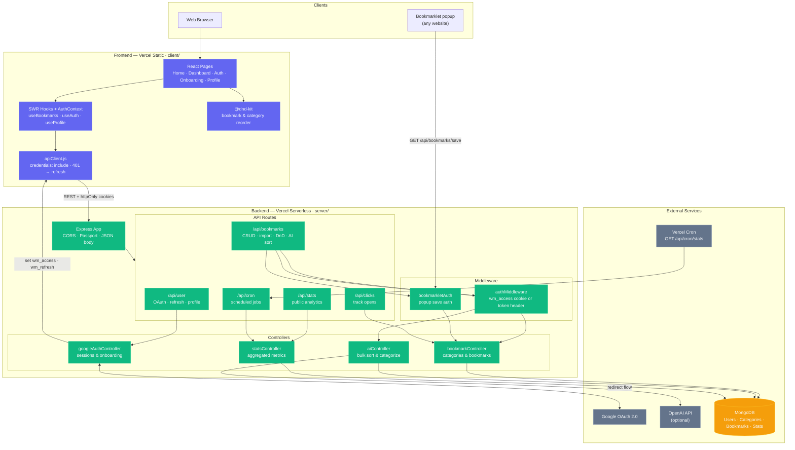

# Webmark

A modern bookmark manager with categories, drag-and-drop organization, browser import, a one-click bookmarklet, and AI-powered sorting.

**Live:** [webmark.chahatkesh.me](https://webmark.chahatkesh.me)

## Features

- **Google sign-in** — OAuth with httpOnly session cookies and automatic token refresh
- **Categories** — Custom names, emoji icons, and color themes
- **Bookmarks** — Add, edit, delete, and reorder with drag-and-drop (within and across categories)
- **Search** — Instant client-side filtering across bookmark names and URLs
- **Bookmarklet** — Save any page from your browser toolbar; AI assigns a category
- **Import** — Bring in bookmarks from Chrome/Firefox HTML exports
- **AI sort** — Bulk reorganize bookmarks with OpenAI (optional, requires API key)
- **Onboarding** — Guided setup for new users with default categories
- **Profile** — Update display name and account details

## Tech Stack

| Layer      | Technologies                                                         |
| ---------- | -------------------------------------------------------------------- |
| Frontend   | React 18, Vite, Tailwind CSS, Radix UI, SWR, @dnd-kit, Framer Motion |
| Backend    | Node.js, Express, MongoDB, Mongoose, Passport (Google OAuth), JWT    |
| Tooling    | pnpm workspaces, ESLint, Prettier, Husky, GitHub Actions             |
| Deployment | Vercel (client + server)                                             |

## System Architecture


```mermaid
flowchart TB
    subgraph Clients["Clients"]
        Browser["Web Browser"]
        Bookmarklet["Bookmarklet popup\n(any website)"]
    end

    subgraph Frontend["Frontend — Vercel Static · client/"]
        direction TB
        Pages["React Pages\nHome · Dashboard · Auth · Onboarding · Profile"]
        Hooks["SWR Hooks + AuthContext\nuseBookmarks · useAuth · useProfile"]
        ApiClient["apiClient.js\ncredentials: include · 401 → refresh"]
        DnD["@dnd-kit\nbookmark & category reorder"]
        Pages --> Hooks
        Hooks --> ApiClient
        Pages --> DnD
    end

    subgraph Backend["Backend — Vercel Serverless · server/"]
        direction TB
        Express["Express App\nCORS · Passport · JSON body"]

        subgraph Routes["API Routes"]
            UserRoute["/api/user\nOAuth · refresh · profile"]
            BookmarkRoute["/api/bookmarks\nCRUD · import · DnD · AI sort"]
            StatsRoute["/api/stats\npublic analytics"]
            CronRoute["/api/cron\nscheduled jobs"]
            ClickRoute["/api/clicks\ntrack opens"]
        end

        subgraph Middleware["Middleware"]
            AuthMW["authMiddleware\nwm_access cookie or token header"]
            BmlMW["bookmarkletAuth\npopup save auth"]
        end

        subgraph Controllers["Controllers"]
            GoogleAuth["googleAuthController\nsessions & onboarding"]
            BookmarkCtrl["bookmarkController\ncategories & bookmarks"]
            AICtrl["aiController\nbulk sort & categorize"]
            StatsCtrl["statsController\naggregated metrics"]
        end

        Express --> Routes
        UserRoute --> GoogleAuth
        BookmarkRoute --> AuthMW --> BookmarkCtrl
        BookmarkRoute --> BmlMW --> BookmarkCtrl
        BookmarkRoute --> AuthMW --> AICtrl
        StatsRoute --> StatsCtrl
        CronRoute --> StatsCtrl
        ClickRoute --> BookmarkCtrl
    end

    subgraph External["External Services"]
        Google["Google OAuth 2.0"]
        OpenAI["OpenAI API\n(optional)"]
        MongoDB[("MongoDB\nUsers · Categories · Bookmarks · Stats")]
        VercelCron["Vercel Cron\nGET /api/cron/stats"]
    end

    Browser --> Pages
    Bookmarklet -->|"GET /api/bookmarks/save"| BmlMW

    ApiClient -->|"REST + httpOnly cookies"| Express
    GoogleAuth <-->|"redirect flow"| Google
    GoogleAuth -->|"set wm_access · wm_refresh"| ApiClient

    BookmarkCtrl --> MongoDB
    AICtrl --> OpenAI
    AICtrl --> MongoDB
    StatsCtrl --> MongoDB
    VercelCron --> CronRoute

    classDef client fill:#6366f1,stroke:#818cf8,color:#f8fafc
    classDef server fill:#10b981,stroke:#34d399,color:#f8fafc
    classDef data fill:#f59e0b,stroke:#fbbf24,color:#f8fafc
    classDef external fill:#64748b,stroke:#94a3b8,color:#f8fafc

    class Pages,Hooks,ApiClient,DnD client
    class Express,UserRoute,BookmarkRoute,StatsRoute,CronRoute,ClickRoute,AuthMW,BmlMW,GoogleAuth,BookmarkCtrl,AICtrl,StatsCtrl server
    class MongoDB data
    class Google,OpenAI,VercelCron external
```

**Key flows:**

1. **Auth** — User signs in via Google OAuth → server sets `wm_access` and `wm_refresh` httpOnly cookies → `apiClient` auto-refreshes on 401.
2. **Dashboard** — SWR fetches categories/bookmarks → drag-and-drop updates persist via reorder API → MongoDB.
3. **Bookmarklet** — Popup on any site hits `/api/bookmarks/save` → AI assigns category (if OpenAI key is set) → dashboard cache revalidates.
4. **Production cron** — Vercel Cron triggers `/api/cron/stats` to collect public usage metrics (replaces in-process `node-cron` on serverless).

## Getting Started

### Prerequisites

- Node.js 20+
- [pnpm](https://pnpm.io/)
- MongoDB (local or [Atlas](https://www.mongodb.com/cloud/atlas))
- Google OAuth credentials ([setup guide](./docs/GOOGLE_AUTH_SETUP.md))
- OpenAI API key (optional, for AI sort and bookmarklet categorization)

### Setup

```bash
git clone https://github.com/chahatkesh/webmark.git
cd webmark
pnpm install

cp server/.env.example server/.env
cp client/.env.example client/.env
# Edit server/.env — at minimum: MONGO_URI, JWT_SECRET, GOOGLE_CLIENT_ID, GOOGLE_CLIENT_SECRET
# Edit client/.env — set VITE_API_URL=http://localhost:4000
```

### Run locally

```bash
pnpm dev
```

This starts both apps via `mprocs:`

- Frontend → http://localhost:5173
- Backend → http://localhost:4000

Or run them separately:

```bash
pnpm dev:client
pnpm dev:server
```

## Scripts

| Command             | Description                             |
| ------------------- | --------------------------------------- |
| `pnpm dev`          | Start client and server together        |
| `pnpm dev:client`   | Start Vite dev server                   |
| `pnpm dev:server`   | Start Express with nodemon              |
| `pnpm lint`         | Lint client and server                  |
| `pnpm type-check`   | TypeScript check (client UI components) |
| `pnpm format`       | Format all files with Prettier          |
| `pnpm format:check` | Check formatting (used in CI)           |

## Project Structure

```
webmark/
├── client/                 # React + Vite frontend
│   └── src/
│       ├── components/     # UI, dashboard, and home page components
│       ├── context/        # Auth and store providers
│       ├── hooks/          # SWR data hooks
│       ├── pages/          # Route-level pages
│       └── utils/          # API client, DnD helpers, SEO utilities
├── server/                 # Express API
│   ├── controllers/        # Route handlers
│   ├── middleware/         # Auth and bookmarklet middleware
│   ├── models/             # Mongoose schemas
│   ├── routes/             # API route definitions
│   └── utils/              # AI categorizer, cron jobs, sessions
├── docs/                   # Detailed documentation
└── .github/workflows/      # CI and Vercel deploy pipelines
```

## Documentation

| Document                                                     | Description                           |
| ------------------------------------------------------------ | ------------------------------------- |
| [Developer Setup](./docs/DEVELOPER_SETUP.md)                 | Full local development guide          |
| [Deployment](./docs/DEPLOYMENT.md)                           | Vercel deployment and CI/CD           |
| [API Reference](./docs/API_DOCUMENTATION.md)                 | REST endpoint documentation           |
| [Auth & Sessions](./docs/AUTH_SESSION_FLOW.md)               | Cookie-based auth and refresh flow    |
| [Google OAuth Setup](./docs/GOOGLE_AUTH_SETUP.md)            | OAuth credential configuration        |
| [Bookmark Categorization](./docs/BOOKMARK_CATEGORIZATION.md) | Category and bookmark data model      |
| [Drag & Drop](./docs/DRAG_DROP_FUNCTIONALITY.md)             | DnD implementation details            |
| [Search](./docs/SEARCH_FUNCTIONALITY.md)                     | Client-side search architecture       |
| [User Onboarding](./docs/USER_ONBOARDING.md)                 | New user flow                         |
| [Error Handling](./docs/ERROR_HANDLING_README.md)            | Client error boundaries and reporting |
| [SEO](./docs/SEO_IMPLEMENTATION.md)                          | SEO and sitemap setup                 |

## Contributing

1. Fork the repo and create a branch: `git checkout -b feature/your-feature`
2. Make your changes and run `pnpm lint && pnpm format:check`
3. Push and open a pull request against `main`

## Author

Built by [Chahat Kesharwani](https://chahatkesh.me)
