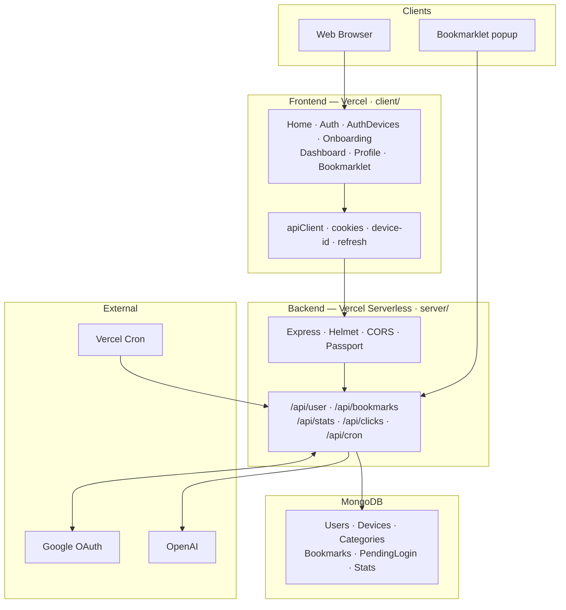

# Webmark

A modern bookmark manager with categories, drag-and-drop organization, browser import, a one-click bookmarklet, AI-powered sorting, and multi-device sessions.

**Live:** [webmark.chahatkesh.me](https://webmark.chahatkesh.me)

## Features

- **Google sign-in** — OAuth with httpOnly cookies, refresh rotation, and rate-limited auth
- **Device limit** — Up to 2 active devices; revoke from Profile or during sign-in
- **Categories** — Custom names, emoji icons, and color themes
- **Bookmarks** — Add, edit, notes, delete, and reorder (within and across categories)
- **Search** — Instant client-side filtering across names, URLs, notes, and categories
- **Bookmarklet** — Save any page from the toolbar; AI can assign a category
- **Import** — Chrome/Firefox HTML exports with monthly quotas
- **AI sort** — Bulk reorganize with OpenAI (credit-gated; revert supported)
- **Onboarding** — Username setup with seeded starter categories
- **Profile** — Display name, credits, click analytics, top bookmarks, devices

## Tech Stack

| Layer      | Technologies                                                                             |
| ---------- | ---------------------------------------------------------------------------------------- |
| Frontend   | React 18, Vite, Tailwind CSS, Radix UI, SWR, @dnd-kit, Framer Motion, Recharts           |
| Backend    | Node.js, Express, MongoDB, Mongoose, Passport (Google OAuth), JWT, Helmet, rate limiting |
| Tooling    | pnpm workspaces, ESLint, Prettier, Husky, GitHub Actions                                 |
| Deployment | Vercel (static client + serverless API)                                                  |

## System Architecture


```mermaid
flowchart TB
    subgraph Clients["Clients"]
        Browser["Web Browser"]
        Bookmarklet["Bookmarklet popup"]
    end

    subgraph Frontend["Frontend — Vercel · client/"]
        Pages["Home · Auth · AuthDevices · Onboarding\nDashboard · Profile · Bookmarklet"]
        ApiClient["apiClient · cookies · device-id · refresh"]
        Pages --> ApiClient
    end

    subgraph Backend["Backend — Vercel Serverless · server/"]
        Express["Express · Helmet · CORS · Passport"]
        APIs["/api/user · /api/bookmarks\n/api/stats · /api/clicks · /api/cron"]
        Express --> APIs
    end

    subgraph Data["MongoDB"]
        DB["Users · Devices · Categories\nBookmarks · PendingLogin · Stats"]
    end

    subgraph External["External"]
        Google["Google OAuth"]
        OpenAI["OpenAI"]
        Cron["Vercel Cron"]
    end

    Browser --> Pages
    Bookmarklet --> APIs
    ApiClient --> Express
    APIs --> DB
    APIs <--> Google
    APIs --> OpenAI
    Cron --> APIs
```

**Key flows:**

1. **Auth** — Google OAuth → `wm_access` / `wm_refresh` cookies → optional `/auth/devices` → onboarding or dashboard.
2. **Dashboard** — One categories request (bookmarks embedded) → DnD persists via reorder APIs.
3. **Bookmarklet** — Server HTML popup at `/api/bookmarks/save` → optional AI category → open tabs sync.
4. **Cron** — Vercel Cron hits `/api/cron/stats` daily for public metrics.

## Getting Started

### Prerequisites

- Node.js 20+
- [pnpm](https://pnpm.io/)
- MongoDB (local or [Atlas](https://www.mongodb.com/cloud/atlas))
- [Google OAuth credentials](./docs/getting-started/google-oauth.md)
- OpenAI API key (optional — AI sort and bookmarklet categorization)

### Setup

```bash
git clone https://github.com/chahatkesh/webmark.git
cd webmark
pnpm install

cp server/.env.example server/.env
cp client/.env.example client/.env
# Edit server/.env — MONGO_URI, JWT_SECRET, GOOGLE_CLIENT_ID, GOOGLE_CLIENT_SECRET
# Edit client/.env — VITE_API_URL=http://localhost:4000
```

### Run locally

```bash
pnpm dev
```

- Frontend → http://localhost:5173
- Backend → http://localhost:4000

Or separately: `pnpm dev:client` / `pnpm dev:server`.

Full guide: [Developer Setup](./docs/getting-started/developer-setup.md).

## Scripts

| Command             | Description                      |
| ------------------- | -------------------------------- |
| `pnpm dev`          | Start client and server together |
| `pnpm dev:client`   | Vite dev server                  |
| `pnpm dev:server`   | Express with nodemon             |
| `pnpm lint`         | Lint client and server           |
| `pnpm type-check`   | TypeScript check (client UI)     |
| `pnpm format`       | Format with Prettier             |
| `pnpm format:check` | Check formatting (CI)            |

## Project Structure

```
webmark/
├── client/                 # React + Vite frontend
│   └── src/
│       ├── components/     # UI, dashboard, home, profile
│       ├── context/        # Auth and store providers
│       ├── hooks/          # SWR data hooks
│       ├── pages/          # Route-level pages
│       └── utils/          # API client, DnD, SEO, device ID
├── server/                 # Express API
│   ├── controllers/
│   ├── middleware/         # Auth, bookmarklet, rate limits
│   ├── models/
│   ├── routes/
│   └── utils/              # Sessions, AI, devices, cron
├── docs/                   # Documentation (see below)
└── .github/workflows/      # CI and Vercel deploy
```

## Documentation

Browse the full index in [docs/README.md](./docs/README.md).

| Area                                                         | Highlights                                                                                         |
| ------------------------------------------------------------ | -------------------------------------------------------------------------------------------------- |
| [Architecture](./docs/architecture/overview.md)              | System design and [data model](./docs/architecture/data-model.md)                                  |
| [Getting Started](./docs/getting-started/developer-setup.md) | Local setup and [Google OAuth](./docs/getting-started/google-oauth.md)                             |
| [Deployment](./docs/deployment/vercel.md)                    | Vercel, [env vars](./docs/deployment/environment-variables.md), [CI/CD](./docs/deployment/cicd.md) |
| [Auth](./docs/auth/session-flow.md)                          | Sessions and [device management](./docs/auth/device-management.md)                                 |
| [Features](./docs/features/bookmarks-and-categories.md)      | Bookmarks, DnD, search, bookmarklet, AI sort, import, profile, onboarding                          |
| [API Reference](./docs/api/reference.md)                     | REST endpoints and rate limits                                                                     |
| [Frontend](./docs/frontend/seo.md)                           | SEO and [error handling](./docs/frontend/error-handling.md)                                        |

## Contributing

1. Fork and branch: `git checkout -b feature/your-feature`
2. Run `pnpm lint && pnpm format:check`
3. Open a pull request against `main`

## Author

Built by [Chahat Kesharwani](https://chahatkesh.me)
