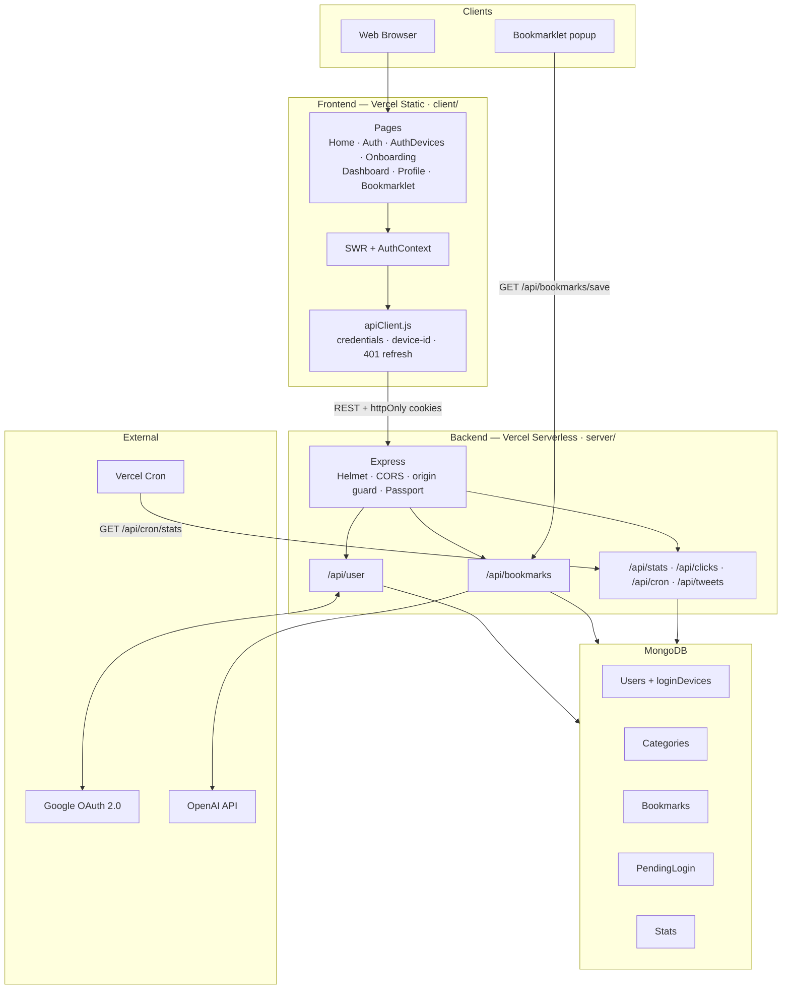

# System Overview

Webmark is a pnpm monorepo with a React/Vite client and an Express/MongoDB API. Both deploy to Vercel (static frontend + serverless Node API).

**Live:** [webmark.chahatkesh.me](https://webmark.chahatkesh.me)

## Tech Stack

| Layer      | Technologies                                                                                  |
| ---------- | --------------------------------------------------------------------------------------------- |
| Frontend   | React 18, Vite, Tailwind CSS, Radix UI, SWR, @dnd-kit, Framer Motion, Recharts                |
| Backend    | Node.js, Express, MongoDB, Mongoose, Passport (Google OAuth), JWT, Helmet, express-rate-limit |
| AI         | OpenAI (`gpt-4o-mini`) for taxonomy and categorization                                        |
| Tooling    | pnpm workspaces, ESLint, Prettier, Husky, GitHub Actions                                      |
| Deployment | Vercel (client static + server `@vercel/node`)                                                |

## High-Level Architecture



## Request Paths

| Client entry  | Server surface            | Notes                                             |
| ------------- | ------------------------- | ------------------------------------------------- |
| SPA pages     | `/api/*` via `apiClient`  | Cookie auth + automatic refresh                   |
| Bookmarklet   | `GET /api/bookmarks/save` | Server-rendered HTML popup; silent cookie refresh |
| Landing stats | `GET /api/stats/public`   | Rate-limited, in-memory cache                     |
| Vercel Cron   | `GET /api/cron/stats`     | Bearer `CRON_SECRET` in production                |

## Key Flows

1. **Auth** — Google OAuth → `wm_access` + `wm_refresh` cookies → optional device-limit picker → onboarding or dashboard.
2. **Dashboard** — One `GET /api/bookmarks/categories` loads categories with embedded bookmarks → DnD persists via `reorder-layout` / `categories/reorder`.
3. **Bookmarklet** — Popup saves URL, AI assigns category when `OPENAI_API_KEY` is set, open tabs revalidate via BroadcastChannel.
4. **AI Sort** — Credit-gated bulk taxonomy + assignment; snapshot enables one revert.
5. **Stats cron** — Daily collection into the `Stats` collection (Vercel Cron in prod; `node-cron` locally).

## Repository Layout

```
webmark/
├── client/                 # React + Vite
│   └── src/
│       ├── components/     # UI, dashboard, home, profile
│       ├── context/        # Auth + store providers
│       ├── hooks/          # SWR data hooks
│       ├── pages/          # Route-level pages
│       └── utils/          # API client, DnD, SEO, device ID
├── server/                 # Express API
│   ├── config/             # DB + Passport
│   ├── controllers/
│   ├── middleware/         # Auth, bookmarklet, rate limits
│   ├── models/
│   ├── routes/
│   └── utils/              # Sessions, AI, cron, devices
├── docs/                   # This documentation
└── .github/workflows/      # CI + Vercel deploy
```

## Serverless Notes

- `server/server.js` exports the Express app and only calls `listen()` when not on Vercel.
- MongoDB uses a cached Mongoose connection promise (`config/db.js`).
- In-process cron is disabled when `VERCEL=1`; production uses HTTP cron.
- API state lives in MongoDB only (no local filesystem state).
