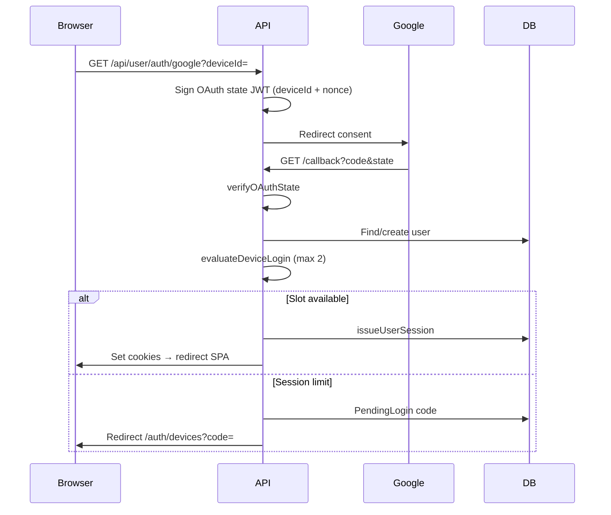

# Authentication & Session Flow

Webmark authenticates exclusively with Google OAuth. API authorization uses short-lived JWT access tokens and long-lived refresh tokens stored in httpOnly cookies.

## Cookies

| Cookie       | Purpose                                                     |
| ------------ | ----------------------------------------------------------- |
| `wm_access`  | Short-lived JWT (`typ: access`), default TTL 15m            |
| `wm_refresh` | Opaque random token; SHA-256 hash stored on the user/device |

Also accepted (legacy): `Authorization: Bearer` and `token` header.

Cookie helpers: `server/utils/authTokens.js`.

## Login



1. Client starts OAuth with a stable `deviceId` (`client/src/utils/deviceId.js`).
2. Callback completes Passport Google strategy (`server/config/passport.js`).
3. Device logic in `deviceController` / `deviceTracking` either issues a session or starts pending login.
4. SPA calls `POST /api/user/userdata` with `credentials: include`.

Redirects:

- New user (no onboarding) → `/onboarding`
- Existing user → `/auth` then dashboard
- Device conflict → `/auth/devices?code=...`

## Refresh

All SPA requests go through `client/src/utils/apiClient.js`.

On `401`:

1. Start one shared `POST /api/user/refresh` (single-flight).
2. Concurrent callers await the same promise.
3. Server verifies `wm_refresh` against current or previous hash (30s grace).
4. Refresh token rotates; new cookies are set.
5. Original request retries once.

This avoids refresh storms and infinite loops. Use `skipAuthRefresh: true` for logout / pending-login calls.

## Logout

`POST /api/user/logout` (auth required) clears **this device only**:

- Access and refresh cookies
- Current device session in `loginDevices[]` (when bound)
- User-level refresh mirror when it matched this device
- Previous refresh grace hashes and session expiration

Other devices keep their sessions. To sign out another device, use Profile revoke (`POST /api/user/devices/revoke`) — see [Device Management](./device-management.md).

Client also clears legacy `localStorage.token` via `clearLocalSession()`.

## Middleware Binding

`authMiddleware` (`server/middleware/authmiddleware.js`):

1. Read access token (cookie → Bearer → `token` header)
2. Verify JWT; return structured codes (`ACCESS_TOKEN_EXPIRED`, `INVALID_TOKEN`, …)
3. Load user; check `tokenExpiresAt`
4. If `device-id` header maps to a device with `isActive === false`, reject with `SESSION_REVOKED` and clear cookies
5. Bind `req.deviceId` from refresh cookie → active `loginDevices` entry
6. Migrate legacy plaintext `refreshToken` if present
7. Set `req.user` / `req.userId`

`POST /api/user/refresh` also rejects revoked devices with `SESSION_REVOKED`.

## Cookie Environment

```bash
# Local
COOKIE_SECURE=false
COOKIE_SAMESITE=lax

# Production cross-origin
COOKIE_SECURE=true
COOKIE_SAMESITE=none
```

Optional `COOKIE_DOMAIN=.example.com` when SPA and API share a parent domain.

## Related Rate Limits

| Limiter                | Window | Max |
| ---------------------- | ------ | --- |
| `authRateLimit`        | 15m    | 30  |
| `refreshRateLimit`     | 15m    | 60  |
| `deviceLoginRateLimit` | 15m    | 20  |

See [Device Management](./device-management.md) for the 2-session cap flow.
